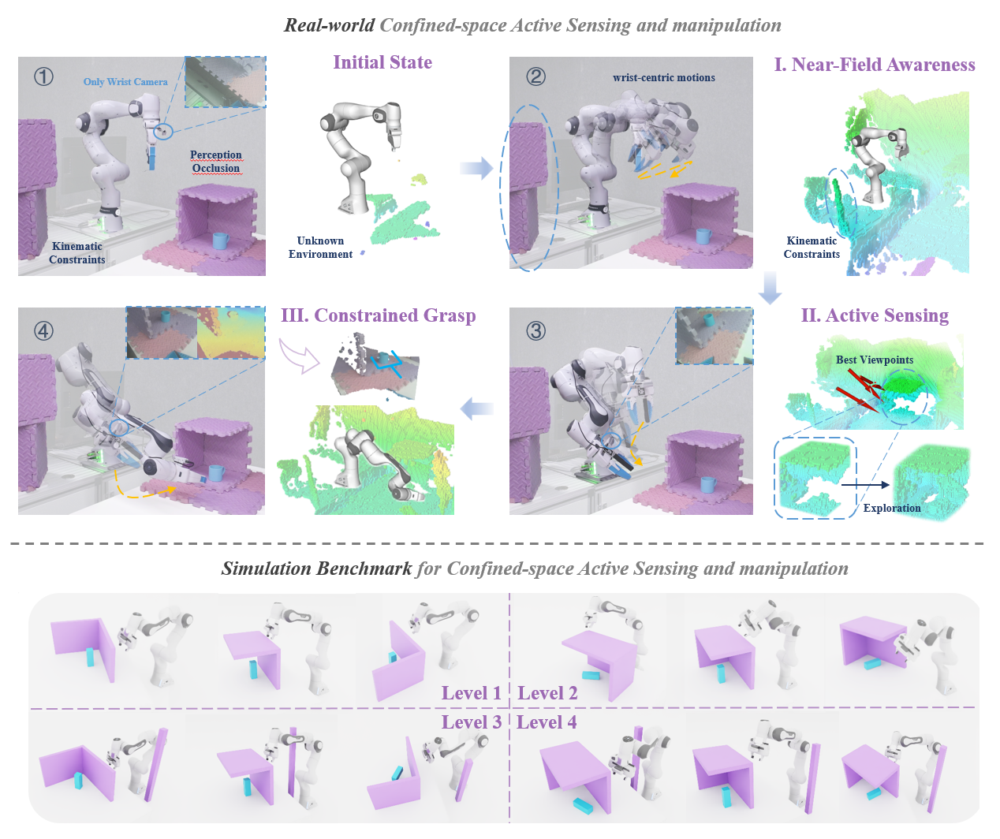

<div align="center">

<h1>COMPASS</h1>

<h3>Confined-space Manipulation Planning with Active Sensing Strategy</h3>

<p>
  <a href="https://qixuanli1212.github.io/compass-project-page/"><strong>Webpage</strong></a>
  &nbsp;&nbsp;|&nbsp;&nbsp;
  <a href="https://arxiv.org/pdf/2509.14787"><strong>Paper</strong></a>
</p>

</div>

<p align="center">
  
</p>

COMPASS is an integrated active sensing and manipulation framework for
confined and cluttered environments, where perception occlusion and kinematic
constraints make conventional perception-then-motion pipelines unreliable.
Using only a wrist-mounted camera, COMPASS incrementally explores an unknown
scene, searches for the target, and generates a collision-aware manipulation
pose.

The framework consists of three stages:

1. **Near-Field Awareness Scan:** performs cautious wrist-centric motions to
   build a local collision map before large-scale exploration.
2. **Manipulation Utility Exploration RRT (MUE-RRT):** selects informative and
   manipulation-friendly viewpoints by jointly considering information gain,
   manipulability, motion cost, and task guidance.
3. **Constrained Grasp:** optimizes manipulation poses while respecting
   kinematic feasibility and environmental obstacle constraints.

The accompanying benchmark contains four levels of confined-space scenes with
increasing perception occlusion and kinematic difficulty. The paper evaluates
COMPASS in both simulation and real-world experiments.

This repository provides the ROS 2, MoveIt 2, and Isaac Sim implementation for
the Franka Panda platform, including project-owned packages, scene
configurations, lightweight Isaac assets, and launch scripts. Third-party
workspaces such as MoveIt 2 and GraspNet are installed separately.

## Installation

COMPASS has been developed and tested with ROS 2 Humble, MoveIt 2, Isaac Sim,
and Python 3.10. We recommend keeping third-party MoveIt sources separate from
the project:

```text
~/ros_workspace/moveit_ws     # Third-party MoveIt source workspace
~/ros_workspace/COMPASS       # This repository
```

### 1. Clone COMPASS

```bash
mkdir -p ~/ros_workspace
cd ~/ros_workspace
git clone https://github.com/LC-Robot/COMPASS.git
cd COMPASS
```

### 2. Install Isaac Sim

Install Isaac Sim in a dedicated Python or conda environment. The tested setup
follows the
[Isaac Lab pip installation guide](https://isaac-sim.github.io/IsaacLab/v2.1.1/source/setup/installation/pip_installation.html).

After installation, set `ISAAC_PYTHON` to the Python executable capable of
importing `isaacsim`:

```bash
export ISAAC_PYTHON=/path/to/isaac/python
```

### 3. Build MoveIt 2

COMPASS does not vendor MoveIt 2. Import and build the required repositories in
a separate workspace:

```bash
mkdir -p ~/ros_workspace/moveit_ws/src
cd ~/ros_workspace/moveit_ws
vcs import src < ~/ros_workspace/COMPASS/dependencies.repos

source /opt/ros/humble/setup.bash
rosdep install --from-paths src --ignore-src -r -y
colcon build
source install/setup.bash
```

### 4. Install GraspNet Baseline

Create a dedicated environment for GraspNet:

```bash
conda create -n graspnet-test python=3.10 -y
conda activate graspnet-test
python -m pip install --upgrade pip setuptools wheel
```

Install the upstream repositories in the package-local paths expected by the
grasp node:

```bash
cd ~/ros_workspace/COMPASS/ros2_ws/src/detect_graspnet/detect_graspnet
git clone https://github.com/graspnet/graspnet-baseline.git
cd graspnet-baseline
pip install -r requirements.txt

cd pointnet2
python setup.py install

cd ../knn
python setup.py install
```

Install GraspNet API:

```bash
cd ~/ros_workspace/COMPASS/ros2_ws/src/detect_graspnet/detect_graspnet
git clone https://github.com/graspnet/graspnetAPI.git
cd graspnetAPI
pip install .

pip install open3d opencv-python scipy spatialmath-python ultralytics
```

Place the GraspNet RealSense checkpoint at:

```text
~/ros_workspace/COMPASS/ros2_ws/src/detect_graspnet/detect_graspnet/logs/log_rs/checkpoint-rs.tar
```

Create the directory and place the checkpoint there:

```bash
mkdir -p ~/ros_workspace/COMPASS/ros2_ws/src/detect_graspnet/detect_graspnet/logs/log_rs
```

The checkpoint and cloned third-party repositories are local dependencies and
must not be committed to COMPASS.

### 5. Build COMPASS

```bash
cd ~/ros_workspace/COMPASS/ros2_ws
source /opt/ros/humble/setup.bash
source ~/ros_workspace/moveit_ws/install/setup.bash

rosdep install --from-paths src --ignore-src -r -y
colcon build
source install/setup.bash
```

Proceed to [Running The Pipeline](#running-the-pipeline) after the two
workspaces and Python environments have been prepared.

## Running The Pipeline
Set the workspace paths:

```bash
export COMPASS_ROOT=~/ros_workspace/COMPASS
export COMPASS_ROS_SETUP=~/ros_workspace/COMPASS/ros2_ws/install/setup.bash
export MOVEIT_SETUP=~/ros_workspace/moveit_ws/install/setup.bash
export ISAAC_PYTHON=/path/to/isaac/python.sh
export GRASPNET_CONDA_ENV=graspnet-test
export COMPASS_YOLO_DEVICE=cuda:0
```

Run a single scene:

```bash
cd ~/ros_workspace/COMPASS
./scripts/start_exploration_single_test.sh
```

Useful optional parameters:

```bash
LEVEL=1 SCENE=1 RUN_ID=1 ./scripts/start_exploration_single_test.sh
```

If YOLO-World reports mixed CPU/CUDA tensors in the GraspNet conda
environment, force the detector to CPU for debugging:

```bash
COMPASS_YOLO_DEVICE=cpu ./scripts/start_exploration_single_test.sh
```

## Citation

If you use COMPASS in your research, please cite:

```bibtex
@article{li2025compass,
  title={COMPASS: Confined-space Manipulation Planning with Active Sensing Strategy},
  author={Li, Qixuan and Le, Chen and Huang, Dongyue and Yu, Jincheng and Chen, Xinlei},
  journal={arXiv preprint arXiv:2509.14787},
  year={2025}
}
```

Paper: [arXiv:2509.14787](https://arxiv.org/abs/2509.14787) |
[Local PDF](COMPASS.pdf)
